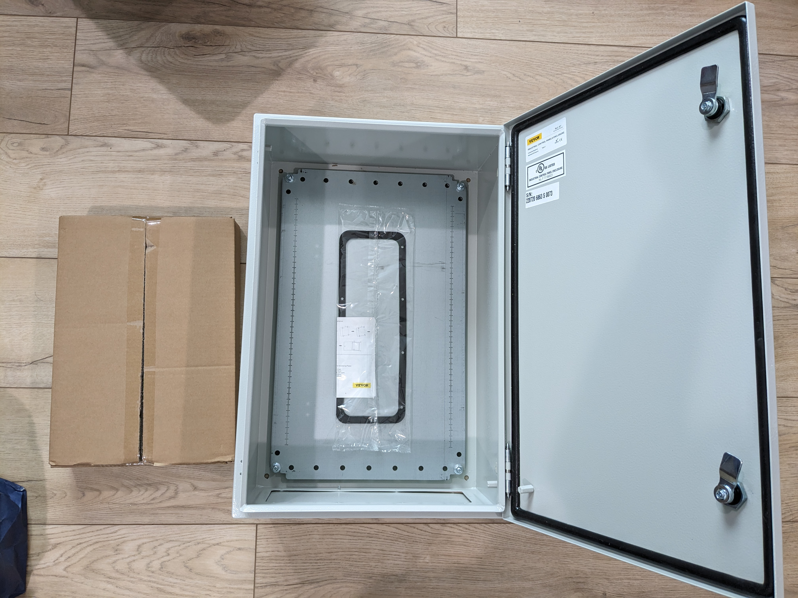
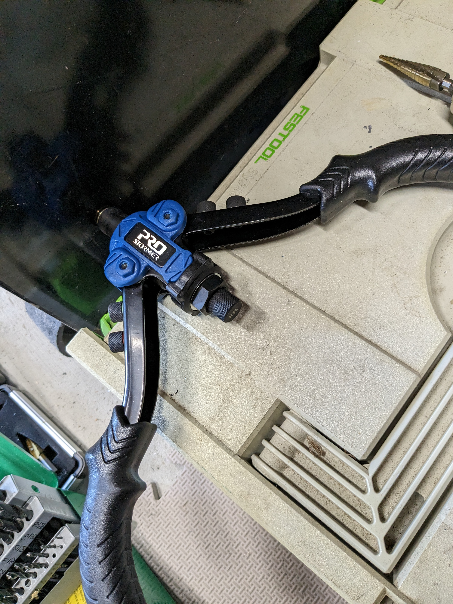
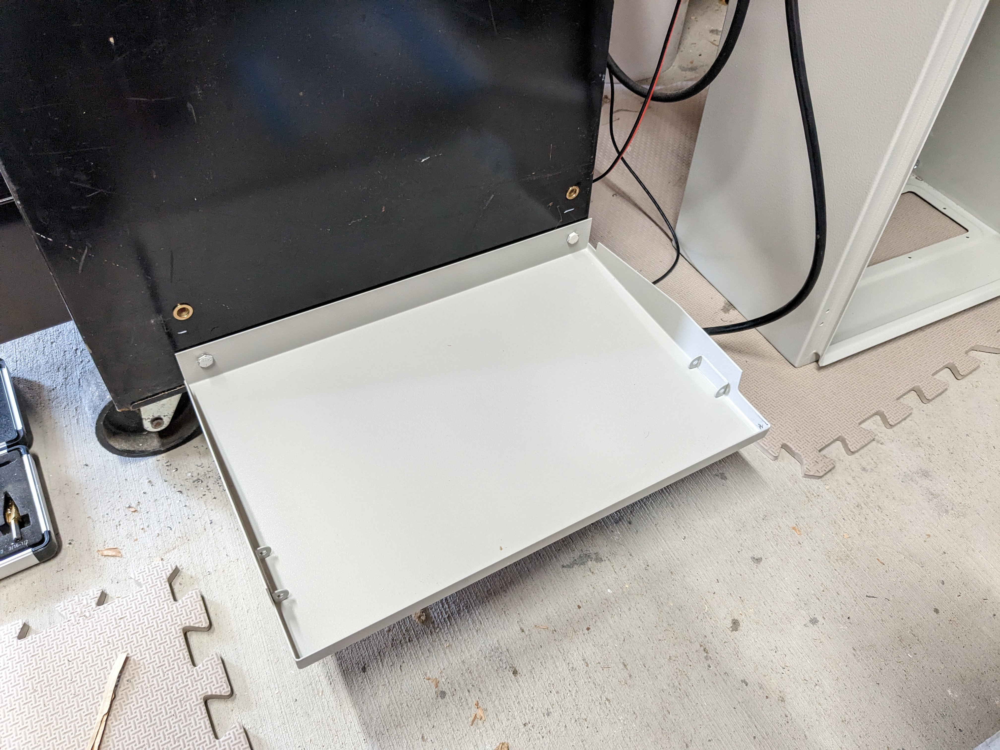
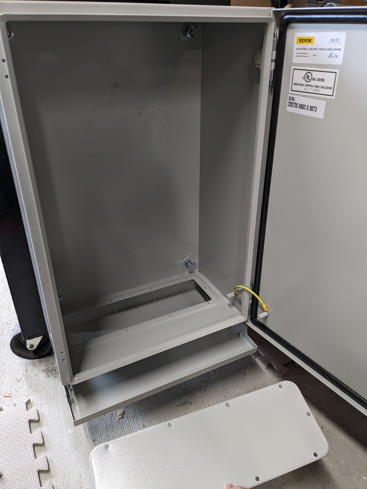
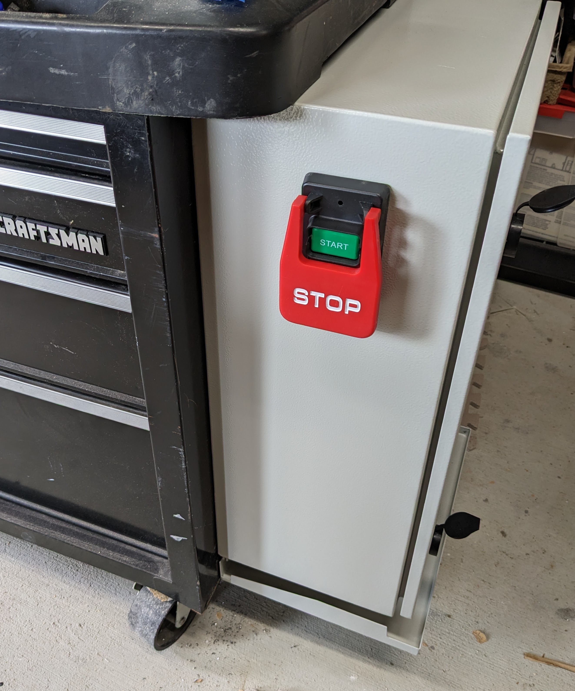
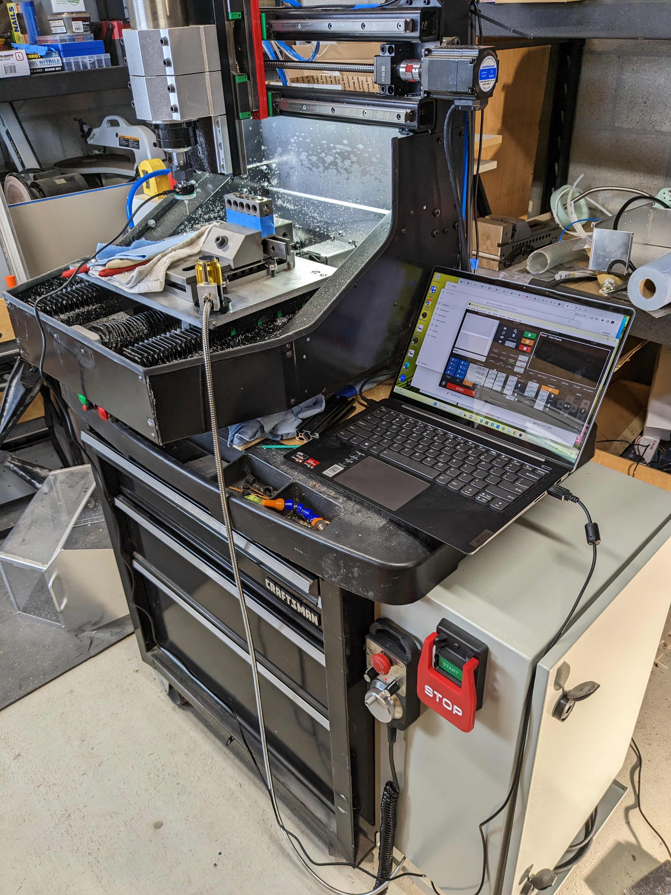

# dmc2-electronics-enclosure
Create an enclosure for the DMC2 electronics that is away from the mill

As you are likely aware, the original enclosure for the DMC2 electronics is somewhat limiting and is mounted in an unaccessible location once complete.
In addition, the 12v power supplies provided by the kit are unsafe and I replaced them with a nice Mean Well DIN mounted equivelant. 

NOTE: TBD I have to still assemble the pump and prove there is no interference between the pump and other electronics.

As the DMC2 mill has cooling fluids, the electonics enclosure should be water resistant from splashes.

I will attempt to list the parts I used along with pictures of my results.

According to various people on the DMC2 users group on FB, a 24"x20"x10" enclosure will be large enough to
nicely layout all the parts without crowding everyhing.   The Z axis cables will need to be longer as I am 
putting the electronics to the bottom right of my rolling cart. If the electronics were behind the machine, 
the current Z cable length would likely be fine. I will also need to extend the end stop wires and various 
power cables.

I ordered an extra set of the Dinkle Terminal blocks as I wanted a couple more in Black and White. 

I added an emergency power switch that kills ALL power to the system.

I also switched out the CRAPPY touch probe and the tool puck for better ones. 

If you assembled the DMC2 yourself, you should already have most (if not all of the tools listed).
If I listed a tool with an Amazon link, it's because I REALLY like it and it was worth buying. 

I got an inexpensive used Craftsman Tool Chest off Craigslist. Time will tell if it's heavy enough to prevent the DMC2 from moving around too much.

For my layout, I needed a slightly long Z stepper cable pair. In addition, I extended all the endstop sensor cables, 12v pump power cable, etc. 
The wires were twisted, soldered and then had heat shrink applied to them.

I used Mike's modified vers.by scripts at:
https://github.com/mikejr83/versby-probing-scripts-mach3

I have more full size photos from the enclosuire build in my Google Album at: 
https://photos.app.goo.gl/r67HLwYJ9gqSSJda6

TO DO:  
-Finish the plumbing and test out the pump. I suspect it will leak at various spots as I had a hard time getting the aluminium bottom around the DMC2 mill.  
-does the enclosure need an addition 12v fan. Figure this out by seeing how hot things get with it close up (with an open bottom).  
-determine if I want to use the Cable Glands (or not) as it would require a bunch of holes in a steel plate along with rewiring. I suspect I'll be happy enough
as is. Enclosing the bottom will make it a bit hotter too.  
-Test out all the modified vers.by scripts  
-I will problably mount the tool setter puck onto the bed and write/edit a Macro to set Z when putting in a new tool.  

## Parts Used

| Item                           | Aprox Cost   | Link                         |
| ------------------------------ |-------------:| :----------------------------|
| Enclosure 24"x20"x10"          |         $160 | [Vevor Enclosure](https://www.amazon.com/gp/product/B0B8Z73W3T/) |
| 12v 10 amp DIN Power supply    |          $35 | [Meanwell EDR-120-12](https://www.amazon.com/gp/product/B00R5CHZAO) |
| DIN Rails 2x 12.9"             |           $7 | [DIN Rails](https://www.amazon.com/gp/product/B088FC2KB8) |
| DIN Rail Terminal Blocks       |          $30 | [Dinkle UL Every Color DIN Rail Terminal Block Kit 20](https://www.amazon.com/gp/product/B07NVV28D9) |
| DIN Terminal Block Connectors  |          $15 | [Dinkle Terminal Block Connectors](https://www.amazon.com/gp/product/B07SVGN5ZJ) |
| Cable Ties with screw bases    |          $13 | [Cable Ties+Bases](https://www.amazon.com/gp/product/B09PV4RP3K) |
| 3-wire to extend end stops     |          $24 | [3-wire 22 gauge 50 feet](https://www.amazon.com/gp/product/B09ZYBZQ31) |
| Cabling Raceway 1"x1.5"        |          $20 | [5 pack cable raceway](https://www.amazon.com/gp/product/B08R75RMQT) |

| Misc                           | Aprox Cost   | Link                         |
| ------------------------------ |-------------:| :----------------------------|
| 120v Power Cable               |          n/a | I had a lot of spare 120v computer power cords and cut them up for the 120v connection |
| Nuts, bolts, screws            |          n/a| |
| Wago connectors | | |
| Heat Shrink tubing | | |
| Plywood ~18"x24"               |          n/a| |

| Optional                       | Aprox Cost   | Link                         |
| ------------------------------ |-------------:| :----------------------------|
| Dinkle Black/White Terminal Blocks |     $30 | [Dinkle UL Black+White DIN Rail Terminal Block Kit](https://www.amazon.com/gp/product/B09JY7WKK4)|
| Cable Glands, assortment       |          $10 | [Cable Glands](https://www.amazon.com/gp/product/B07RHJM435/) |
| Cart for the DMC2              |        $200 | Heavy Cart with castors for the DMC2 |
| Emergency Power Switch         |          $16 | [POWERTEC 71007 110 V to 220V Paddle Switch](https://www.amazon.com/gp/product/B00KPEEPAW/) |
| Longer Close Loop stepper cables |        $14 | [Steppers Online 105" Closed Loop Stepper Cables](https://www.omc-stepperonline.com/2-7m-106-awg20-motor-and-encoder-extension-cable-kit-for-nema-23-and-24-closed-loop-stepper-motors-ce3-m3-20) |
| Tool Height Sensor N.O.        |          $61 | [Auto Tool Sensor Universal Type NC/NO CNC Probe Tool Touch Sensor](https://www.amazon.com/gp/product/B08M97W5MV) |
| Touch Probe N.O.               |          $72 | [Touch Probe Type NO](https://www.amazon.com/gp/product/B0BJ2245HB) |

| Tools.                         | Aprox Cost   | Link if I really like the tool |
| ------------------------------ |-------------:| :------------------------------|
| Jigsaw for the wood | | |
| Drill and bits | | |
| Wrenches, Plyers, Metal Files | | |
| Iwiss crimper kit with Ferrules |         $25 | [Iwiss Ferrule Crimper Kit](https://www.amazon.com/gp/product/B07LCF39W9) |
| Iwiss crimper kit for automotive |        $30 | [Iwiss iCrimp Heat Shrink Connectors Crimping Tool Kit](https://www.amazon.com/gp/product/B07QGZFP9S) |
| Auto Wire Strippers            |          $22 | [Klein Tools 11061 Wire Stripper](https://www.amazon.com/gp/product/B00CXKOEQ6) |
| Soldering Iron + Hot Air       |         $190 | [X-Tronic 6040-PRO-X with soldering iron and hot air](https://www.amazon.com/gp/product/B08PDKP6WB) |

## DMC2 Help
A number of DMC2 owners hang out on Discord at [3D Misfits/CNC](https://discord.gg/86fqsRfz).  
There is also the Facebook [Shariff DMC2 users group](https://www.facebook.com/groups/528581055557390/?ref=share) 

## Pictures

The enclosure after unpacking it from Amazon, pretty heavy.  

I held the box against the side of my rolling cart, traced out the hole pattern and then drilled them out for rivnuts.
The box uses M8 bolts.  

I re-used the top rain shield as a bottom cable rack, it will need reenforcement to not bend.

Positioned on the side of the cart.  

Emergency power switch.  

Finished look.  

